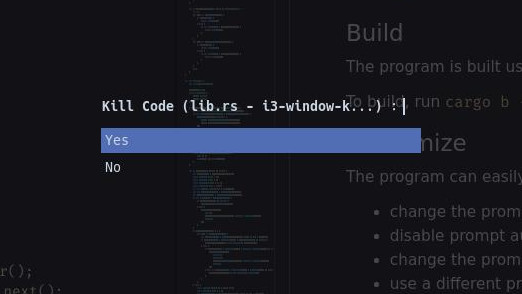
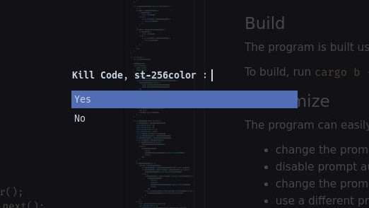

# i3-window-killer: an i3wm node killer

## Description

This simple program prompts the user for confirmation, using **rofi**, before killing the focused node tree on **i3wm**.

The prompt specifies the titles (and classes) of the node(s) composing the targeted tree to quickly assess that the intended nodes are about to be killed.

### Screenshots

Single node prompt exceeding the maximum prompt length:



Multiple nodes prompt:



## Requirements

- [i3](https://github.com/i3/i3) window manager
- [rofi](https://github.com/davatorium/rofi)

## Build

The program is built using `cargo` (_comes with [rustup](https://www.rust-lang.org/tools/install)_).

To build, run `cargo b --release`. The binary will be under `target/release`.

## Usage

Use the binary in your i3 config as follows:

```
bindsym $mod+Shift+a exec --no-startup-id path/to/i3-window-killer
```

## Customize

The program can easily be hacked to fit your preferences. Here are the key points to consider:

- use a specific rofi config file ([fn get_rofi_config_path](src/lib.rs#L21))
- override rofi options ([fn get_rofi_styles](src/lib.rs#L164))