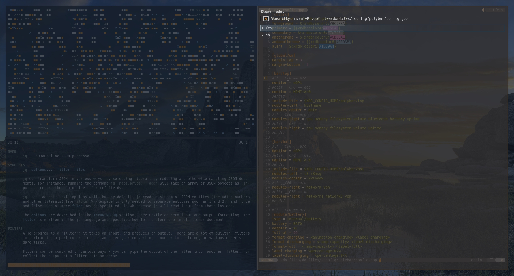
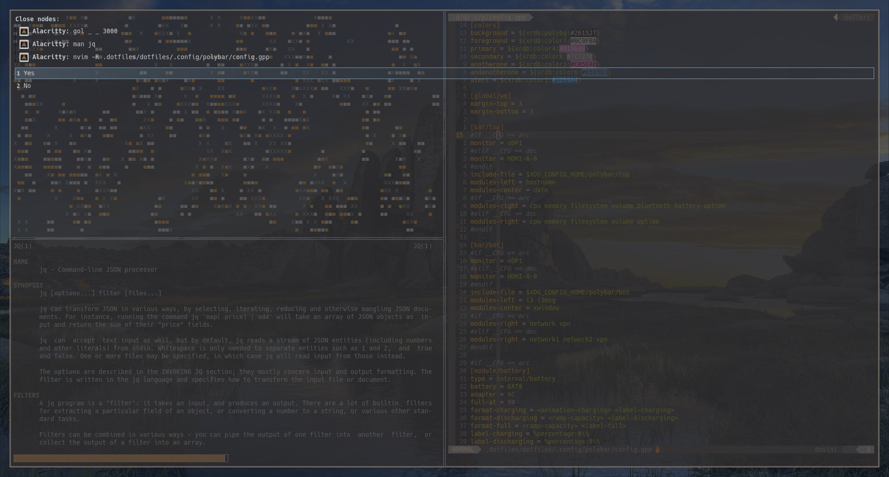

# i3-window-killer: kill i3wm windows with rofi (and style)

## Description

This program presents the user with a customizable **rofi** confirmation prompt before killing the focused **i3wm** node.

The prompt can be styled via a template file, exposing useful variables such as the windows _X11 titles_, _X11 classes_ or _desktop icon_, and allowing block control with loops and conditionals ([template syntax documentation](https://docs.rs/tinytemplate/1.2.1/tinytemplate/syntax/index.html)). An example can be found in [template.rasi](template.rasi) (must be used in conjuction with its rofi [config](config.rasi)).

### Screenshots

Prompt when killing a single window (with a template placing the prompt over the focused node):



Multiple windows prompt:



## Requirements

- [i3](https://github.com/i3/i3)
- [rofi](https://github.com/davatorium/rofi)

## Build

The program is built using `cargo` (comes with [rustup](https://www.rust-lang.org/tools/install)).

To build, run `cargo b --release`. The binary will be under `target/release`.

## Usage

Taken from `--help` output:
```
USAGE:
    kill [FLAGS] [OPTIONS]

FLAGS:
    -d, --dump-styles    
            Dump rendered styles to stdout

    -h, --help           
            Prints help information

        --no-cache       
            Don't read/write cached icons

    -V, --version        
            Prints version information


OPTIONS:
        --cache-dir <DIR>         
            Custom cache directory to use (sub-directory [i3-window-killer] will still be created).
            If unspecified, $XDG_CACHE_HOME or $HOME/.cache will be used [default: /home/user/.cache]
    -o, --outer-gap <INTEGER>     
            Global i3-gaps "gaps outer" rule (in pixels)
            If present in your i3 config, every node inherits the offset but their gaps property does not reflect it, so
            this hint helps in calculating the effective gaps.
    -c, --config <FILE>           
            rofi configuration file (passed as-is to subcommand)

    -t, --template <FILE>         
            rofi styles template
            Template engine syntax: https://docs.rs/tinytemplate/1.2.1/tinytemplate/syntax/index.html
            Interpolated variables:
                - container // Object of the focused node (access props with { container.prop })
                    {
                        top: Integer, // top value of the container rect in pixels
                        right: Integer, 
                        bottom: Integer,
                        left: Integer,
                    }
                - nodes // Array of windows within the container node
                    [
                        { // Object containing node props
                            class: String, // window X11 class
                            title: String, // window X11 title
                            icon: String, // window desktop icon
                        }
                    ]
    -s, --smart-gaps <INTEGER>    
            Global i3-gaps "smart_gaps" rule (0: off, 1: on, 2: inverse_outer) [default: 1]


```

Use the binary in your i3 config as follows:

```
bindsym $mod+Shift+a exec --no-startup-id path/to/i3-window-killer
```

## Customize

You can get started by tinkering with the provided [config](config.rasi) and [template](template.rasi).
The rofi theme format **.rasi** is documented in `rofi-theme(5)`.
> Tip: debug the generated styles by dumping them to `stdout` with the `-d` flag.

The program can be further hacked by modifying the source files:

- change the prompt choices ([fn prompt_user](src/lib.rs))
- change the rofi subcommand flags ([fn prompt_user](src/lib.rs))
- change the prompt text ([fn get_prompt_and_styles](src/lib.rs))

## Misc

Since I found no easy way to map an **X11 WM_CLASS** to its corresponding icon name (rofi already locates the appropriate icon file when given a valid name), I went on an adventure to find the holy string directly in the application's desktop entry:
1. (create and) load the cache dictionnary (usually at `~/.cache/i3-window-killer/icons`)
2. look up the window `class` in the dictionnary (formated `class=icon`)
3. if it exists, use it, else continue
4. walk every `.desktop` file under `/usr/share/applications` (TODO add other possible locations / make it a parameter)
5. look for the best fuzzy match of the `class` on the `Name` key ([freedesktop specification](https://specifications.freedesktop.org/desktop-entry-spec/desktop-entry-spec-latest.html#recognized-keys))
6. get the `Icon` value from the matched desktop entry
7. persist its name to the dictionnary and use it